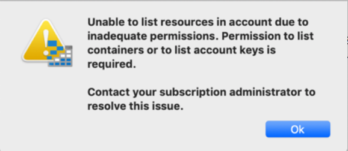

# AZ-104 Practice Test 201 Questions

---
## Q4X:


---

### Answer:

---

### References:

---

---
## Q41:

Your Azure Subscription has the following resources:

- three App Services
- one backup vault
- one Azure Event Hub (AEH)
- a VNet named VNET01
- a VPN Gateway

You deploy a new SA namend storage1 in a RG named RG01.

You need to ensure that the App Services, the Backup Vault and the AEH can access the new SA. 
Access should be enabled from within Azure only and not over the public internet.

You decide to use PowerShell to set up the new SA.
How should you complete the command string?

```
Get-AzVirtualNetwork -ResourceGroupName "RG01" -Name "VNET01" `
| Set-AzVirtualNetworkSubnetConfig -Name "VSUBNET01" -AddressPrefix "10.0.0.0/24" -ServiceEndpoint "OPTIONS-1"  ` 
| Set-AzVirtualNetwork 

$subnet = Get-AzVirtualNetwork -ResourceGroupName "RG01" -Name "VNET01" `
| Get-AzVirtualNetworkSubnetConfig -Name "VSUBNET01"

OPTIONS-2 -ResourceGroupName "RG01" -Name "storage01" -VirtualNetworkResourceId $subnet.Id

OPTIONS-3 -ResourceGroupName "RG01" -Name "storage01" -Bypass OPTIONS-4
```

OPTIONS-1
&
OPTIONS-4:
AzureServices
Logging 
Metrics
Microsoft.Storage
None

OPTIONS-2 
& 
OPTIONS-3:
Add-AzStorageAccountNetworkRule
Remove-AzStorageAccountNetworkRuleSet
Update-AzStorageAccountNetworkRuleSet
Set-AzStorageAccount

---

### Answer:

```
Get-AzVirtualNetwork -ResourceGroupName "RG01" -Name "VNET01" `
| Set-AzVirtualNetworkSubnetConfig -Name "VSUBNET01" -AddressPrefix "10.0.0.0/24" -ServiceEndpoint "Microsoft.Storage"  ` 
| Set-AzVirtualNetwork 

$subnet = Get-AzVirtualNetwork -ResourceGroupName "RG01" -Name "VNET01" `
| Get-AzVirtualNetworkSubnetConfig -Name "VSUBNET01"

Add-AzStorageAccountNetworkRule -ResourceGroupName "RG01" -Name "storage01" -VirtualNetworkResourceId $subnet.Id

Update-AzStorageAccountNetworkRuleSet -ResourceGroupName "RG01" -Name "storage01" -Bypass AzureServices
```

The line: 
`Set-AzVirtualNetworkSubnetConfig -Name "VSUBNET01" -AddressPrefix "10.0.0.0/24" -ServiceEndpoint "Microsoft.Storage"`

allows connections to VNET01 **from** (any) the SA.
`Set-AzVirtualNetworkSubnetConfig` changes only the memory representation of of the VNet.
The followinng command: `Set-AzVirtualNetwork` persists these changes ot the VNet.

`Add-AzStorageAccountNetworkRule` adds a **firewall exception** to the SA's NetworkRule property.
`Update-AzStorageAccountNetworkRuleSet` updates the NetworkRule property of a Storage account with `-Bypass AzureServices`

---

### References:

[Add-AzStorageAccountNetworkRule](https://learn.microsoft.com/en-us/powershell/module/az.storage/add-azstorageaccountnetworkrule?view=azps-11.4.0)   

Add IpRules or VirtualNetworkRules to the NetworkRule property of a Storage account

> Examples:
```
# Example 1: Add several IpRules with IPAddressOrRange
# This command add several IpRules with IPAddressOrRange.
Add-AzStorageAccountNetworkRule -ResourceGroupName "myResourceGroup" -Name "mystorageaccount" -IPAddressOrRange "10.0.0.0/7","28.2.0.0/16"

# Example 2: Add a VirtualNetworkRule with VirtualNetworkResourceID
# This command add a VirtualNetworkRule with VirtualNetworkResourceID.
$subnet = Get-AzVirtualNetwork -ResourceGroupName "myResourceGroup" -Name "myvirtualnetwork" | Get-AzVirtualNetworkSubnetConfig
Add-AzStorageAccountNetworkRule -ResourceGroupName "myResourceGroup" -Name "mystorageaccount" -VirtualNetworkResourceId $subnet[0].Id

# Example 3: Add VirtualNetworkRules with VirtualNetworkRule Objects from another account
$networkrule = Get-AzStorageAccountNetworkRuleSet -ResourceGroupName "myResourceGroup" -Name "mystorageaccount1"
Add-AzStorageAccountNetworkRule -ResourceGroupName "myResourceGroup" -Name "mystorageaccount2" -VirtualNetworkRule $networkrule.VirtualNetworkRules

# Example 6: Add all resource access rules of one storage account to another storage account
(Get-AzStorageAccountNetworkRuleSet -ResourceGroupName "myResourceGroup" -Name "mystorageaccount1").ResourceAccessRules | Add-AzStorageAccountNetworkRule -ResourceGroupName "myResourceGroup" -Name "mystorageaccount2"
```

[Update-AzStorageAccountNetworkRuleSet](https://learn.microsoft.com/en-us/powershell/module/az.storage/update-azstorageaccountnetworkruleset?view=azps-11.4.0)  
Updates the NetworkRule property of a Storage account

> Example 2: Update Bypass property of NetworkRule:
This command clean up rules of NetworkRule of a Storage account (other properties not change)!
```
Update-AzStorageAccountNetworkRuleSet -ResourceGroupName "myResourceGroup" -Name "mystorageaccount" -Bypass AzureServices,Metrics
```

`-Bypass None`: is used to remove access to the SA from any Azure Service.
`-Bypass  Logging,Metrics`: is used to allow logging and metrice of the SA to be collected in Azure.

---

[Configure Azure Storage firewalls and virtual networks](https://learn.microsoft.com/en-us/azure/storage/common/storage-network-security?tabs=azure-portal)  

When you configure network rules, only applications that request data over the specified set of networks or
through the specified set of Azure resources can access a storage account.
You can limit access to your storage account to requests that come from:
- specified IP addresses
- IP ranges
- subnets in an Azure virtual network
- or resource instances of some Azure service

Storage accounts have a public endpoint that's accessible through the internet.
**You can also create private endpoints for your storage account**. 
Creating private endpoints assigns a private IP address from your virtual network to the storage account.
 It helps secure traffic between your virtual network and the storage account over a private link.

**The Azure Storage firewall** provides **access control for the public endpoint** of your storage account. 
**You can also use the firewall to block all access through the public endpoint when you're using private endpoints**.
**Your firewall configuration also enables trusted Azure platform services to access the storage account**.

> Authorization 
An application that accesses a storage account when network rules are in effect still requires proper 
authorization for the request. 
**Authorization is supported with Microsoft Entra credentials** for:
- blobs
- tables
- file shares 
- queues

with a valid account access key, or with a shared access signature (SAS) token. 

> Blob container for anonymous access:
When you configure a **blob container for anonymous access**, requests to read data in that container
don't need to be authorized.
**The firewall rules remain in effect and will block anonymous traffic**.

> Block Access by default with SA firewall rules:
Turning on firewall rules for your storage account blocks incoming requests for data by default, 
unless the requests originate from:
- a service that operates within an Azure virtual network 
- or from allowed public IP addresses. 

Requests that are blocked include:
- those from other Azure services
- from the Azure portal
- and from logging and metrics services

> Exceptions mechanism for the SA Firewall:
You can grant access to Azure services that operate from within a virtual network by allowing traffic 
from the subnet that hosts the service instance. 
You can also enable a limited number of scenarios through the **exceptions mechanism** that this article
describes. 

> Important:
**Storage firewall rules apply to the public endpoint of a storage account.**
**You don't need any firewall access rules to allow traffic for private endpoints of a storage account.**

> Scenarios:


To secure your storage account, you should first configure a rule to deny access to traffic from all
networks (including internet traffic) on the public endpoint, by default. 
Then, you should configure rules that grant access to traffic from specific virtual networks. 
You can also configure rules to grant access to traffic from selected public internet IP address ranges, 
enabling connections from specific internet or on-premises clients. This configuration helps you build 
a secure network boundary for your applications.

> Configure network access to Azure Storage:

- Allow access from selected virtual network subnets using private endpoints.
- Allow access from selected virtual network subnets using service endpoints.
- Allow access from specific public IP addresses or ranges.
- Allow access from selected Azure resource instances.
- Allow access from trusted Azure services (using Manage exceptions).
- Configure exceptions for logging and metrics services.

> Exceptions:

[Configure network access to Azure Storage](https://learn.microsoft.com/en-us/azure/storage/common/storage-network-security?tabs=azure-portal#manage-exceptions)  

In some cases, like storage analytics, access to read resource logs and metrics is 
required from outside the network boundary. When you configure trusted services to
access the storage account, you can allow read access for the log files, metrics tables,
or both by creating a network rule exception.

> Virtual network endpoints:

[About virtual network endpoints](https://learn.microsoft.com/en-us/azure/storage/common/storage-network-security?tabs=azure-portal#about-virtual-network-endpoints)

- Virtual Network service endpoints
- Private endpoints

> Virtual Network service endpoints:
Virtual network service endpoints are public and accessible via the internet. 
he Azure Storage firewall provides the ability to control access to your storage account over such public endpoints.

> Private endpoints:
A private endpoint uses a private IP address from your virtual network to access a storage account over the Microsoft backbone network. 
With a private endpoint, traffic between your virtual network and the storage account are secured over a private link.
**Storage firewall rules only apply to the public endpoints of a storage account, not private endpoints**!

The process of approving the creation of a private endpoint grants implicit access to traffic from the subnet that hosts the private endpoint.
You can use **Network Policies** to control traffic over private endpoints if you want to refine access rules. 
**If you want to use private endpoints exclusively, you can use the firewall to block all access through the public endpoint**.

---

[Use private endpoints for Azure Storage](https://learn.microsoft.com/en-us/azure/storage/common/storage-private-endpoints)  

---


## Q40:

The core application development team in your company needs R/W access to an Azure based storage account as a repository for a new company-wide application.

You need to create a geo-redundant SA within an Azure RG and provide the access control keys to the app dev team.

How should you complete the PowerShell script?

```
OPTIONS-1

Set-AzContext -subscription "SubscriptionName"

OPTIONS-2 -Name "RGName" -Location "East US 2"

New-AzStorageAccount -Name "SAName" -ResourceGroupName "RGName" `
OPTIONS-3 OPTIONS-4 -Location "East US 2"

OPTIONS-5 -ResourceGroupNane "RGName" -Name "SAName"

```

OPTIONS-1: Login-AzAccount | Add-AzureAccount

OPTIONS-2: 
New-AzResourceGroup
New-AzResourceGroupDeployment

OPTIONS-3:
-Kind
-SkuName

OPTIONS-4:
Standard_RAGRS
Standard_GRS
Standard_LRS

OPTIONS-5:
Get-AzKeyVault
Get-AzStorage
Get-AzStorageAccountKey

---

### Answer:

```
Login-AzAccount
Set-AzContext -subscription "SubscriptionName"
New-AzResourceGroup -Name "RGName" -Location "East US 2"
New-AzStorageAccount -Name "SAName" -ResourceGroupName "RGName" `
-SkuName Standard_GRS -Location "East US 2"
Get-AzStorageAccountKey -ResourceGroupNane "RGName" -Name "SAName"
```


---

### References:

[New-AzStorageAccount](https://learn.microsoft.com/en-us/powershell/module/az.storage/new-azstorageaccount?view=azps-11.4.0)   

[Get-AzStorageAccountKey](https://learn.microsoft.com/en-us/powershell/module/az.storage/get-azstorageaccountkey?view=azps-11.4.0)  

```
Get-AzStorageAccountKey -ResourceGroupName "RG01" -Name "mystorageaccount"

# Example 2: Get a specific access key for a Storage account
(Get-AzStorageAccountKey -ResourceGroupName "RG01" -Name "mystorageaccount")| Where-Object {$_.KeyName -eq "key1"}

# include the Kerberos keys (if active directory enabled)
Get-AzStorageAccountKey -ResourceGroupName "RG01" -Name "mystorageaccount" -ListKerbKey
```

[New-AzResourceGroupDeployment](https://learn.microsoft.com/en-us/powershell/module/az.resources/new-azresourcegroupdeployment?view=azps-11.4.0)  
Adds an Azure deployment to a resource group.
A resource group deployment uses a template to add resources to a resource group and publishes them so that they are available in Azure.
To add resources to a resource group without using a template, use the `New-AzResource` cmdlet. 
To add a resource group deployment, specify:
- the name of an existing resource group 
- and a resource group template (JSON file)

> Example 1: Use a custom template and parameter file to create a deployment
```
New-AzResourceGroupDeployment -ResourceGroupName "ContosoEngineering" -TemplateFile "D:\Azure\Templates\EngineeringSite.json" -TemplateParameterFile "D:\Azure\Templates\EngSiteParms.json" -Tag @{"key1"="value1"; "key2"="value2";}
```

> Example 2: Use a custom template object and parameter file to create a deployment
```
$TemplateFileText = [System.IO.File]::ReadAllText("D:\Azure\Templates\EngineeringSite.json")
$TemplateObject = ConvertFrom-Json $TemplateFileText -AsHashtable
New-AzResourceGroupDeployment -ResourceGroupName "ContosoEngineering" -TemplateObject $TemplateObject -TemplateParameterFile "D:\Azure\Templates\EngSiteParams.json"
```

> Example 4: Deploy a template stored in a non public storage account using a uri and SAS token
```
New-AzResourceGroupDeployment -ResourceGroupName "RGName" -TemplateUri "https://example.com/example.json" -QueryString "foo"
```

-

## Q39:

Your company creates multiple management groups under the root MG.

You are reorganizing the MGs and want to move all resources for Sales and Marketing
MGs under the Marketing MG.

Once finished, you plan to delete the Sales MG.

You need to move the subscription named SalesSub to the Marketing MG.

Which two PowerShell cmdlets should you use?

- Remove-AzManagementGroup
- Update-AzManagementGroup
- Remove-AzManagementGroupSubscription
- New-AzManagementGroupSubscription

---

### Answer:

Moving a subscription to another MG implicitly means that the subscription
already has a MG. 

- Remove-AzManagementGroupSubscription
- New-AzManagementGroupSubscription

- Remove-AzManagementGroup:
 this simply deletes a MG

- Update-AzManagementGroup
this is used to update supported params for teh MG.

---

### References:

[Manage your Azure subscriptions at scale with management groups](https://learn.microsoft.com/en-us/azure/governance/management-groups/manage)  

[Moving management groups and subscriptions](https://learn.microsoft.com/en-us/azure/governance/management-groups/manage#moving-management-groups-and-subscriptions)  

[New-AzManagementGroupSubscription](https://learn.microsoft.com/en-us/powershell/module/az.resources/new-azmanagementgroupsubscription?view=azps-11.4.0&viewFallbackFrom=azps-10.1.0)
Adds a Subscription to a Management Group.

[Remove-AzManagementGroupSubscription](https://learn.microsoft.com/en-us/powershell/module/az.resources/remove-azmanagementgroupsubscription?view=azps-11.4.0&viewFallbackFrom=azps-10.2.0) 
Removes a Subscription from a Management Group.

[Move subscriptions in PowerShell](Mhttps://learn.microsoft.com/en-us/azure/governance/management-groups/manage#move-subscriptions-in-powershell)  

```
New-AzManagementGroupSubscription -GroupId 'Contoso' -SubscriptionId 'GUID-NEW-SUBSCRIPTION'

# To remove the link between the subscription and the management group use
Remove-AzManagementGroupSubscription -GroupId 'Contoso' -SubscriptionId '12345678-1234-1234-1234-123456789012'
```

---

## Q38:

You manage a number of Azure subscriptions for a global organization
and have ownership of all these subscriptions.

Yuo have been asked to use PowerShell to migrate the resorces from 
`sub01` to `sub02`.

After the migration you find that all teh Azure Role Assignments for 
individual rosources have been orphaned on VMs but are still in place
for RGs.

You need to find out the cause of the missing role assignments to 
ensure that this incident does niot repeat in future migrations.

What is the cause of the problem?

- the migration was between subscriptions
- the azure portal was not used for the migration
- the user account used to move the resources to `sub02` die not have the required permissions
- there was a networ outage during the migration


---

### Answer:
- the migration was between subscriptions

In the migration of resources from one subscriptions to another
any **roles assigned directly to the resources arne not moved**.
All the role assignments must be recreated and the orhaned  assignments will be **automatically** removed.

This does not depend on whether PowerShell or the Azure Portal 
is used to perform teh migration.

The **Owner** role on source and target subscriptions is assigned 
to the user account and that was used to run the migration script 
and this role provides sufficient rights.

---

### References:

[Move Azure resources to a new resource group or subscription](https://learn.microsoft.com/en-us/azure/azure-resource-manager/management/move-resource-group-and-subscription)  

If you move a resource that has an Azure role assigned directly to the resource (or a child resource), the role assignment isn't moved and becomes orphaned. After the move, you must re-create the role assignment. Eventually, the orphaned role assignment is automatically removed, but we recommend removing the role assignment before the move.

For information about how to manage role assignments, see List Azure role assignments and Assign Azure roles.

For a move across subscriptions, the resource and its dependent resources must be located in the same resource group and they must be moved together. For example, a VM with managed disks would require the VM and the managed disks to be moved together, along with other dependent resources.

The account moving the resources must have at least the following permissions:

`Microsoft.Resources/subscriptions/resourceGroups/moveResources/action` 
on the source resource group.

`Microsoft.Resources/subscriptions/resourceGroups/write` 
on the destination resource group.

The destination subscription must be registered for the resource provider of the resource being moved. If not, you receive an error stating that the subscription is not registered for a resource type. You might see this error when moving a resource to a new subscription, but that subscription has never been used with that resource type.

...

The source and destination subscriptions must exist within the same Microsoft Entra tenant. To check that both subscriptions have the same tenant ID, use Azure PowerShell or Azure CLI.

[Transfer an Azure subscription to a different Microsoft Entra directory](https://learn.microsoft.com/en-us/azure/role-based-access-control/transfer-subscription)    


---

## Q37:

a company has an existing on-prem environment and a newly created 
Azure subscription.

You need to start testing cloud features and services with a view to eventually migrating the on-prem environment to the cloud.

You have been given **Global Administrator** rights and
**Resource Policy Contributior role** on the subscription.

You need to test Azure Policy first.

You have downloaded version 2.38 of Azuire CLI to configure new policies. 

You find that the Azure Policies you create do not work with your 
subscription.

What is the cause of the problem?
 
- you lack teh relevant role assignment to manage Azure Policy
- the version of tht Azure CLI: it must be updated
- you do niot have relevant access to the subscription
- you have not resistered the Azure Policy Insights Resource Provider

---

### Answer:
- you have not resistered the Azure Policy Insights Resource Provider

`Microsoft.PolicyInsights` must be registered in your Azure subscription. To register a resource provider, you must have permission to register resource providers. 

That permission is included in the: 
- Contributor and Owner roles.

However, you have been assigned the roles:
- **Global Administrator**
- **Resource Policy Contributior role** 

on the subscription.

Thereofore the `Microsoft.PolicyInsights` Provider must be registered  
**manually** on the subscription.

The roles that have ben assigned are sufficient to manage 
all aspect of Azure Policy on the subscription.

---

### References:

[Tutorial: Create and manage policies to enforce compliance](https://learn.microsoft.com/en-us/azure/governance/policy/tutorials/create-and-manage)   


[Quickstart: Create a policy assignment to identify non-compliant resources using Azure CL](https://learn.microsoft.com/en-us/azure/governance/policy/assign-policy-azurecli)   


---

## Q36:

Your company hosts its infrastructure as a IaaS in Azure.
You have taken over the management of the IaaS in Azure from
another IT technitian, who was responsible for creating and 
managing all resources within the tenant.

The owner of teh development subscription within the tenant
wants to block anyone from deleting ther `devtest-rg` an any 
of its resources,**without having to add any type of resource lock**
**at subscriotion level**.

You must recommend a solution to facuilitate this requirement.
You muts minimize admin effort.

What should you recommend?

- add a read-only lock on the RG
- add a delete lock on the RG
- add a delete lock on a single resource of the RG
- add a read-only lock on the subscription

---

### Answer:
- add a delete lock on the RG
This is obviously the right answer.

Refer to previous questions and answers for teh details.

---

### References:

---

## Q35:

a company hosts resources in Azure and Microsoft 365.
A storage account was recently created for the Marketing department
but it was not picked in the monlthly usage report.
Further investigation shows that no resource tags were configured
for this SA when it was created.

You need to add the resource tags to the SA to fix the problem.
Comnplete the PowerShell script accordingly.

```
$tags = @{"Dept"="Marketing","Status"="Standard"}
$resource = OPTIONS-1 - Name marketingsa -ResourceGroup ukmkrg01
OPTIONS-2 -ResourceId $resource.Id -Tag $tags
```

OPTIONS-1:
Get-AzResource
Get-AzResourceGroup
Get-AzResourceLock
New-AzResource

OPTIONS-2:
New-AzTag 
Get-AzTag 
Get-AzResource
Get-AzResourceLock

---

### Answer:

```
$tags = @{"Dept"="Marketing","Status"="Standard"}
$resource = Get-AzResource - Name marketingsa -ResourceGroup ukmkrg01
New-AzTag -ResourceId $resource.Id -Tag $tags
```

---

### References:

[New-AzTag](https://learn.microsoft.com/en-us/powershell/module/az.resources/new-aztag?view=azps-11.4.0&viewFallbackFrom=azps-8.2.0)   

> Example 5: Creates or updates the entire set of tags on a subscription

```
$Tags = @{"tagKey1"="tagValue1"; "tagKey2"="tagValue2"}
New-AzTag -ResourceId /subscriptions/xxxxxxxx-xxxx-xxxx-xxxx-xxxxxxxxxxxx -Tag $Tags

```

---

## Q34:

A company has a Microsoft Entra Tenant.
A recent governance audit for the ME-Tenant has found that all users currently 
have the ability to create management groups within the tenant.
Tou need to enable **hierarchy protection** so that only admins can create 
managemnent groups.

You need to create a JSON script to set the relevant permission levels
to ensure that standard users are no longer allowed to create MGs.

Which ooperation do you need to set in your JSON file to meet the goal?

- Microsoft.Management/managementGroups/delete
- Microsoft.Management/managementGroups/subscriptios/write
- Microsoft.Management/managementGroups/read
- Microsoft.Management/managementGroups/write

---

### Answer:

---

### References:

[How to protect your resource hierarchy](https://learn.microsoft.com/en-us/azure/governance/management-groups/how-to/protect-resource-hierarchy)   

Settings at the root management group, such as Azure custom roles or Azure Policy policy assignments, can impact every resource in your resource hierarchy. 

It's important to protect the resource hierarchy from changes that could negatively impact all resources.

**Management groups now have hierarchy settings that enable the tenant administrator to control these behaviors.** 

> Azure RBAC permissions for hierarchy settings

Configuring any of the hierarchy settings requires the following two resource provider operations on the root management group:

```
Microsoft.Management/managementgroups/settings/write
Microsoft.Management/managementgroups/settings/read
```

These operations only allow a user to read and update 
the hierarchy settings. 
Both of these operations are available in the Azure 
**built-in role Hierarchy Settings Administrator**.
The operations don't provide any other access to the management group hierarchy or resources in the hierarchy. 

> Setting - Default management group

By allowing the default management group for new subscriptions to be defined, organization-wide governance constructs can be applied at the root management group, and a **separate management group** with **policy assignments or Azure role assignments** more suited to a new subscription can be defined.

[Setting - Require authorization](https://learn.microsoft.com/en-us/azure/governance/management-groups/how-to/protect-resource-hierarchy#setting---require-authorization)   

Any user, by default, can create new management groups within a tenant. Admins of a tenant may wish to only provide these permissions to specific users to maintain consistency and conformity in the management group hierarchy. 

If enabled, a user requires the:

`Microsoft.Management/managementGroups/write` 

operation on the root management group to create new child management groups.

---

[Quickstart: Create a management group](https://learn.microsoft.com/en-us/azure/governance/management-groups/create-management-group-portal)  

---

## Q33:

Your company is gradually moving its on-prem computing infrastructure to Azure.
Four on-prem 8-core VMs that run Windows Server 2016 DataCenter are hosted
on a computer that is being retired.
The VMs are licensed under two 16-core licences.
The servers do not get continual use but need to be available on a as-needed basis.
Windows Server 2016 DataCenter has active Software Assurance.

You plan to move three VMs to Azure VMs and the fourth to a VM on a different on-prem host.

You need to minimize costs related to teh three Azure VMs.

What should you do?

- deploy the VMs as part of a VM scale set
- use the Azure Hybrid Benefit on the VMs
- create a budget in Azure Portal
- configure Reserved Instances for th VMs

---

### Answer:
- use the Azure Hybrid Benefit on the VMs
The VMs are licensed under two 16-core licences.
This lets you run two 8-core VMs on each license either in Azure or on-prem, that is 
you can split the license into two 8-core VMs the way you prefer it.
In contrast, the **Windows Styandard License** allow to run a VM each either on-prem or Azure. (?)

The remanining options do not apply:

- configure Reserved Instances for th VMs
This is a **one-year or three-year agreemnet** and is best suited to VMs that are run continuosly.
In this case the usage is intermittent on a as-needed basis therefore a pay-as-you-go model
is preferable as it may save costs.

- deploy the VMs as part of a VM scale set
This is clearly not the use-case for VMSS.

- create a budget in Azure Portal
this has to do with cost management in the Azure Portakl and not with this specific case.


---

### References:

[Azure Hybrid Benefit Frequently Asked Questions](https://azure.microsoft.com/en-us/pricing/hybrid-benefit/#faq)  

[Azure Hybrid Benefit for Windows Server](https://learn.microsoft.com/en-us/windows-server/get-started/azure-hybrid-benefit?tabs=azure)  

Azure Hybrid Benefit enables commercial customers to use their qualifying on-premises licenses to get Windows virtual machines (VMs) on Azure at a reduced cost. 

- Windows Server VMs in Azure
Windows Server VMs on Azure: The license for Windows Server is covered by Azure Hybrid Benefit, so you only need to pay for the base compute rate of the VM. The base compute rate is equal to the Linux rate for VMs.

> Number of licenses:
You need a minimum of 8 core licenses (Datacenter or Standard edition) per VM. For example, 8 core licenses are still required if you run a 4-core instance. You may also run instances larger than 8 cores by allocating licenses equal to the core size of the instance. For example, 12 core licenses are required for a 12-core instance. For customers with processor licenses, each 2-core processor license is equivalent to 16 core licenses.

- Azure Stack HCI
- Azure Kubernetes Service (AKS) 

hybrid deployments.

To qualify for Azure Hybrid Benefit for Windows Server, you need on-premises core licenses for Windows Server from an applicable program with active Software Assurance or qualifying subscription licenses. 

Workloads using Azure Hybrid Benefit can run only during the Software Assurance or subscription license term. When the Software Assurance or subscription license term approaches expiration, you must either renew your agreement with either Software Assurance or a subscription license, disable the hybrid benefit functionality, or deprovision those workloads that are using Azure Hybrid Benefit.

---

## Q32:

Your Azure subscription has multiple RGs that host project-level resources.
All team members that usethe subscription have contributor access 
at the subscription level and are allowed to manage resources for all projects.

The `company1-network-rg` contains all the newtowr resources such as
VNets, NSGs, DNS Zones, Route Tables.

As the need arises, network admins add new DNS entries and routes 
and create additional subnets and NSGs.

You must ensure that no security member, including network admins can
delete any resources hosted in `company1-network-rg`.
The solution must provide minimal onging admin effort.

What shouuld you do?

- apply ReadOnly lock to `company1-network-rg`
- apply CanNotDelete lock to `company1-network-rg`

- create a custom role that denies delete for `company1-network-rg` and
  apply this new role to a security group and add all users to this SG.

- create a custom role that denies delete for Vnet, NSG, DNS Zones, Route Tables 
  resource types.
  apply this new role to a security group and add all users to this SG. 

---

### Answer:
- apply CanNotDelete lock to `company1-network-rg`
This is the obvious answer, any other applicable options imply much higher admin effort.

The following do not apply:

- create a custom role that denies delete for `company1-network-rg` and
  apply this new role to a security group and add all users to this SG.
This would prevent the delition of the RG but not the deletion of the resources in it!

- create a custom role that denies delete for Vnet, NSG, DNS Zones, Route Tables 
  resource types.
  apply this new role to a security group and add all users to this SG. 
Obvuously, this is not maintanable!

---

### References:


---

## Q31:

You develop a policy that will deny teh creation of any resource that 
does not have an environment tag with a value of either dev, qa, prod.

You must ensure that only resources that support tagging are subject 
to thsi policy.

Complete teh JSON policy template.

```
{
  "properties": {
    "displayName": "Tag und zugehöriger Wert für Ressourcen erforderlich",
    "policyType": "BuiltIn",
    "mode": "OPTIONS-1 : All | Indexed | Supported",
    "parameters": {
      "tagName": {
        "type": "String",        
      },
      "tagValue": {
        "type": "String",        
      }
    },
    "policyRule": {
      "if": {
        "not": {
          "field": "OPTIONS-2",
          "OPTIONS-3": "{dev. qa, prod}"
          
          //"field": "[concat('tags[', parameters('tagName'), ']')]",
          //"equals": "[parameters('tagValue')]"
        }
      },
      "then": {
        "effect": "OPTIONS-3: append | audit | deny"
        //"effect": "deny"
      }
    }
  },  
  "type": "Microsoft.Authorization/policyDefinitions",
  "name": "policyDefinition01"
}
```

OPTIONS-2:

Environment
tag:Enviroment
[tag[Enviroment]]

OPTIONS-3:

equals
notContains
notIn
---

### Answer:


```
{
  "properties": {
    "displayName": "Tag und zugehöriger Wert für Ressourcen erforderlich",
    "policyType": "BuiltIn",
    "mode": "Indexed",
    "parameters": {
      "tagName": {
        "type": "String",        
      },
      "tagValue": {
        "type": "String",        
      }
    },
    "policyRule": {
      "if": {
        "not": {
          "field": "[tag[Enviroment]]",
          "notIn": "{dev. qa, prod}"         
          
        }
      },
      "then": {
        "effect": "deny"        
      }
    }
  },  
  "type": "Microsoft.Authorization/policyDefinitions",
  "name": "policyDefinition01"
}
```

`"mode": "Indexed",`:
OPTIONS-1 : All | Indexed | Supported

The **Indexed** options for the **mode** property of the policy def is correct.
Indexed policies check whether a reosurce supports a feature before checking the 
resource for compliance with the policy.

**Supported** is a fake value that is not availbale for the **mode** property of 
the policy def is correct.

`"field": "[tag[Enviroment]]",`
OPTIONS-2:
Environment
tag:Enviroment
[tag[Enviroment]]

Tags on a resource are an array ov objects with each having a name and a value.

`"effect": "deny"`
OPTIONS-3: equals | notContains | notIn
This is obvious, you want the policy to deny the deplyment operation if any the 
agreed tags are not present or their values in not any of the "{dev. qa, prod}"

---

### References:

[Assign policy definitions for tag compliance](https://learn.microsoft.com/en-us/azure/azure-resource-manager/management/tag-policies)  

[Azure Policy definition structure](https://learn.microsoft.com/en-us/azure/governance/policy/concepts/definition-structure)  

---

## Q30:

You have a storage accounts in your Azure subscription for different purposes.
The SAs have blob containers and file shares.

Some users access these SAs by using the **Microsoft Storage Explorer Desktop App**.
They report that they get the error message in the exhibit whn they try to browse
the contents of the SA.

You must resolve teh issue.
Which are two possible reasons for this error?

- there is a CanNotDelete lock 
- there is a ReadOnly lock 
- users have the Storage Blob Data Contributor role assigned in the SAs
- users have the Read role assigned in the SAs
- users have the Storage Blob Data Read role assigned in the SAs



---

### Answer:

- there is a ReadOnly lock 
- users have the Read role assigned in the SAs

[Considerations before applying your locks](https://learn.microsoft.com/en-us/azure/azure-resource-manager/management/lock-resources?tabs=json#considerations-before-applying-your-locks)  

This reference explains that:

The **Storage Account API** exposes **data plane** and **control plane** operations. 

> If a request uses data plane operations:
the lock on the storage account doesn't protect blob, queue, table, or file data within that storage account. 

> If the request uses control plane operations: the lock protects those resources.

The user oprocess for the the **Microsoft Storage Explorer Desktop App** needs to read 
the access keys of the SA before listing the contents of the containers in it. 
The access keys of the SA provide write access to all data in the SA and there is no 
read only access key in the SA and in order to perform teh listing of the contents of
the SA the user needs **read-write** permission.

A ReadOnly lock as well as only the Read role assigned to users in the SAs would prevent
the enforcement of teh required **read-write** permission.

The rmaing optins do not apply:

- there is a CanNotDelete lock:
this lock type does not prevent read-write operations on the resource

- users have the Storage Blob Data Contributor role assigned in the SAs:
this would provide read-write permissions to the resource SA

- users have the **Storage Blob Data Read role** assigned in the SAs
this role allows users to **read and list** the SA containers and blobs!


---

### References:

[Azure built-in rolesStorage Blob Data Reader](https://learn.microsoft.com/en-us/azure/role-based-access-control/built-in-roles/storage#storage-blob-data-reader)  

Read and list Azure Storage containers and blobs. 

---


## Q29:

Your subscription has: 

- a RGs for production env
- a RGs for testing env TST0X-rg

A user member of the RegularUsers group accidentally deletes TST01-rg & TST03-rg.

TST01-rg had a **Storage Account** named STA01.
TST02-rg had a **App Service** named APP01.

**You recover the affected resource from backups**.

You then decide to implement resource lock to prevent this from happening again.
Your manager would like teh following points implemented in order to prevent this
type of incident in the future.

- no resources can be deleted by accident
- all resource types should work correctly after implementing the resource lock
- any new resource that is added to teh subscription should be protected against deletion
- the solution should require the least admin affort

What should you do?

- consfigure a read-only lock on TST01-rg and TST02-rg
- consfigure a delete lock on TST01-rg and TST02-rg
- consfigure a read-only lock on the subscription
- consfigure a delete lock on the subscription

---

### Answer:
- consfigure a delete lock on the subscription

A delete lock can be used at the follwing levels:
- resource
- RG
- subscription

Locks are hinerited down this chain of containers.
The **delete (CanNotDelete)** lock prevents deletion of resources but does not hinder 
operations to be performed on them.

The remainign options do not apply:

The **read-only** would not be suitable in this case i.e. the RGs could not be modified
and also any resource in them.
Depending on teh resource **read-only** locks **may lead to uunpredictable outcomes**.
This is explained in details in one of the answer to a a previopus question and in the 
following reference:

[Considerations before applying your locks](https://learn.microsoft.com/en-us/azure/azure-resource-manager/management/lock-resources?tabs=json#considerations-before-applying-your-locks)  

In a nutshell, the **read-only** lock **prevents POST** post operations on the 
**control level** of any resource. If the operation uses this to be perform the 
lock will prevent the operation.

---

### References:

---

## Q28:

You create a Windows Server VM in an Azure RG named `iaas-rg`.
You plan to **generalize the OS and caputure an image** for future deployments.

You must ensure that other administrators make no changes to teh VM
configuration until you complete the image capture process.
You need to enact the solution as quickly as possible.

What should you do?

- set a delete lock on the VM
- set a read-only lock on the VM
- edit RBAC permissions at the RG level
- edit RBAC permissions at the VM level

---

### Answer:
- set a read-only lock on the VM

This is obviously the quickiest way to prevent mods to the VM while
its image is captured. 
The **delete** lock would only protect from deletion of the VM and not 
modificatuions to its configuration while the **read-only** lock prevents
these.

The soltions based on RBAC require more admin effort before and after teh capture
process.


---

### References:

---

## Q27:

You are lead architect for your company's Microsoft Azure Infrastructure.
To maintain corporate compliance certifications, you must ensure that any
VM are created only in approved regions.

What should you do?

- create an Azure management group
- enforce conditional access policy in Microsoft Entra ID
- define and deply an Azure Automation Desired State Configuration (DCS)
- define and deploy a custom Azure Policy template


---

### Answer:
- define and deploy a custom Azure Policy template

The remaining options do not apply:

- create an Azure management group
- enforce conditional access policy in Microsoft Entra ID
- define and deply an Azure Automation Desired State Configuration (DCS)


---

### References:

[Tutorial: Create and manage policies to enforce compliance](https://learn.microsoft.com/en-us/azure/governance/policy/tutorials/create-and-manage)  

[What are Azure management groups?](https://learn.microsoft.com/en-us/azure/governance/management-groups/overview)  

If your **organization has many Azure subscriptions**, you may need a way to efficiently manage:

- access, policies
- compliance 

for those subscriptions.
Management groups **provide a governance scope above subscriptions**. 
You organize subscriptions into management groups; 
the governance conditions you apply cascade by inheritance to all associated subscriptions.

---

[Azure Automation State Configuration overview](https://learn.microsoft.com/en-us/azure/automation/automation-dsc-overview)  

[Understanding Azure Machine Configuration](https://learn.microsoft.com/en-us/azure/governance/machine-configuration/overview)  

[Tutorial: Create a custom policy definition](https://learn.microsoft.com/en-us/azure/governance/policy/tutorials/create-custom-policy-definition)  

Rules often enforce:
- Security practices use SSL, etc.
- Cost management i.e. use tags
- Organization-specific rules (like naming or locations)

[What is Conditional Access?](https://learn.microsoft.com/en-us/entra/identity/conditional-access/overview)   

Conditional Access policies are enforced after first-factor authentication is completed.
isn't intended to be an organization's first line of defense for scenarios like denial-of-service (DoS) attacks

- Empower users to be productive wherever and whenever
- Protect the organization's assets

Conditional Access policies at their simplest are if-then statements.
if a user wants to access a resource, then they must complete an action.

> Scenarios for most organizations:

Requiring multifactor authentication for users with administrative roles
Requiring multifactor authentication for Azure management tasks
Blocking sign-ins for users attempting to use legacy authentication protocols
Requiring trusted locations for security information registration
Blocking or granting access from specific locations
Blocking risky sign-in behaviors
Requiring organization-managed devices for specific applications

>For example: 
If a user wants to access an application or service like Microsoft 365, 
then they must perform multifactor authentication to gain access.

> Signal > Decision > Enforment (Decision)
> Common signals:
- User or group membership
- IP Location information
- Device
- Applications that the user tries to access
- Real-time calculated risk detection

> Sources of signals:
- Microsoft Entra ID
- Microsoft Defender for Identity
- Microsoft Defender 
- Microsoft Endpoint Manager

> Decisions:
- Block access
Most restrictive decision

- Grant access
Less restrictive decision, can require one or more of the following options:
Require multifactor authentication
Require authentication strength
Require device to be marked as compliant
Require Microsoft Entra hybrid joined device
Require approved client app
Require app protection policy
Require password change
Require terms of use
Commonly applie

---

## Q26

You build a new Marketing solution in an Azure RG called RG1.
RG1 has an existing tag with the name Department and its value is Marketing.

You plan to use **SAzure Cloud Shell** to add another tag to RG1
with the name Status and the value Approved.

You must ensure that RG1's existing tag is preserved.

Complete the PowerShell command.

```
$tags = (Get-AzResourceGroup -Name RG1).Tags
OPTIONS-1 {"Status","Approved"}
OPTIONS-2 -Tag $tags - Name OPTIONS-3
```
```
OPTIONS-1
$tags.Add
$tags |Add

OPTIONS-2
Neew-AzTag
Set-AzResourceGroup

OPTIONS-3
RG1
$tags
```

---

### Answer:

```
$tags = (Get-AzResourceGroup -Name RG1).Tags
$tags.Add {"Status","Approved"}
Set-AzResourceGroup -Tag $tags - Name RG1 
```

---

### References:


> In one of the questions below there is a similare scenario:
```
$r = Get-AzResource -ResourceName "corpstorage99" 
-ResourceGroupName "prod-rg" 
$r.Tags.Add("Dept"."IT")
Set-AzResource -Tag $r.Tags -ResourceId $r.ResourceId -Force
```

[Set-AzResourceGroup](https://learn.microsoft.com/en-us/powershell/module/az.resources/set-azresourcegroup?view=azps-11.4.0&viewFallbackFrom=azps-2.6.0)     

[New-AzTag](https://learn.microsoft.com/en-us/powershell/module/az.resources/new-aztag?view=azps-11.4.0&viewFallbackFrom=azps-3.6.1)  

CreatePredefinedTagSet: The New-AzTag cmdlet creates a predefined Azure tag with an optional predefined value. 
You can also use it to add additional values to existing predefined tags.

> Example 1: Create a predefined tag with no value
```
New-AzTag -Name "FY2015"

Name   ValuesTable Count Values 
----   ----------- ----- ------
FY2015             0     {}
```

> Example 2: Create a predefined tag with a value

```
New-AzTag -Name "Department" -Value "Finance"

Name:   Department
Count:  0
Values:

Name        Count
        =========   =====
        Finance     0
```

> Example 3: Add a value to a predefined tag

```
New-AzTag -Name "Department" -Value "Finance"
New-AzTag -Name "Department" -Value "IT"
Name:   Department
Count:  0
Values: 
        Name        Count
        =========   =====
        Finance     0
        IT          0
```

> Example 4: Use a predefined tag
```
New-AzTag -Name "CostCenter" -Value "0001"
Get-AzResourceGroup -Tag @{Name="CostCenter"}
Set-AzResourceGroup -Name "EngineerBlog" -Tag @{Name="CostCenter";Value="0002"}
```

---

## Q25:

You have an Azure RG named RG1.
RG1 contains 12 VMs that run Windows Server or Linux.

You need to use Azure Cloud Shell to lift any resource 
locks that amy have been applied to the VMs.

How should you colplte the command:

```
$rg = "rg1"
OPTIONS-1 | OPTIONS-2 ResorceGroupName - eq "$rg" | OPTIONS-3 -Force
```

OPTIONS-1
Get-AzResource
Get-AzResourceLock

OPTIONS-2
Select-Object
Where-Object

OPTIONS-3
Remove-AzResource
Remove-AzResourceLock

---

### Answer:

```
$rg = "rg1"
Get-AzResourceLock | Where-Object ResorceGroupName - eq "$rg" | Remove-AzResourceLock -Force
```

---

### References:

[Get-AzResourceLock](https://learn.microsoft.com/en-us/powershell/module/az.resources/get-azresourcelock?view=azps-11.4.0)   

> Example 1: Get a lock
```
Get-AzResourceLock -LockName "ContosoSiteLock" -ResourceName "ContosoSite" -ResourceType "microsoft.web/sites" -ResourceGroupName "ResourceGroup11"
```
This command gets the resource lock named ContosoSiteLock.

> Example 2: Get locks at resource group level or higher
`Get-AzResourceLock -ResourceGroupName "ResourceGroup11" -AtScope`
This command gets the resource locks on the resource group or the subscription.

[Remove-AzResourceLock](https://learn.microsoft.com/en-us/powershell/module/az.resources/remove-azresourcelock?view=azps-11.4.0&viewFallbackFrom=azps-2.6.0)   

```
Remove-AzResourceLock -LockName "ContosoSiteLock" -ResourceName "/subscriptions/00000000-0000-0000-0000-000000000000/resourceGroups/Default-Storage-SouthCentralUS/providers/Microsoft.ClassicStorage/storageAccounts/mystorageaccount/providers/Microsoft.Authorization/locks/test"
```

[Remove-AzResource](https://learn.microsoft.com/en-us/powershell/module/az.resources/remove-azresource?view=azps-11.4.0&viewFallbackFrom=azps-5.8.0)  

---

[AZ-104 Lab - Locking Resources](https://www.udemy.com/course/microsoft-certified-azure-administrator/learn/lecture/13165368#overview)  

[AZ-104 Locks and moving resources](https://www.udemy.com/course/microsoft-certified-azure-administrator/learn/lecture/30375242#overview)  

---

[Lock your resources to protect your infrastructure](https://learn.microsoft.com/en-us/azure/azure-resource-manager/management/lock-resources?tabs=json#considerations-before-applying-your-locks)  

Locks only apply to **control plane Azure operations** 
and not to **data plane operations**.

Azure **control plane** operations go to: `https://management.azure.com`

Azure **data plane** operations go to your service instance, such as:
`https://myaccount.blob.core.windows.net/`

The distinction means locks protect a resource from changes, but 
they don't restrict how a resource performs its functions. 

> For example: 

 A **ReadOnly lock** on an **SQL Database logical server**, protects it from deletions or modifications. It allows you to create, update, or delete data in the server database. 
 Data plane operations allow data transactions.

[Considerations before applying your locks](https://learn.microsoft.com/en-us/azure/azure-resource-manager/management/lock-resources?tabs=json#considerations-before-applying-your-locks)  

Applying locks can lead to unexpected results. 
**Locks prevent the POST method from sending data to the Azure Resource Manager (ARM) API**.

> Some common examples of blocked operations are:

Remember:

Locks on resources prevent: **control plane operation**.
Locks on resources DO NOT prevent: **data plane operation**.

**We recommend that you use a control plane operation**.

- read-only lock on a storage account:
prevents users from listing the account keys. 

A POST request handles the Azure Storage List Keys operation to protect access to the account keys. The account keys provide complete access to data in the storage account. When a read-only lock is configured for a storage account, users who don't have the account keys need to use Microsoft Entra credentials to access blob or queue data. 

A read-only lock also prevents the assignment of Azure RBAC roles that are scoped to 
the storage account or to a data container (blob container or queue).

- A read-only lock on a storage account prevents the creation of a blob container.

- A read-only lock or cannot-delete lock on a storage account
doesn't prevent its data from deletion or modification. 
It also doesn't protect the data in a blob, queue, table, or file.

> Explanation:
The Storage Account API exposes data plane and control plane operations. 
If a request uses data plane operations, the lock on the storage account 
doesn't protect blob, queue, table, or file data within that storage account. 
If the request uses control plane operations, however, the lock protects those resources.

- Example on File Share:

For example, if a request uses **File Shares - Delete**, which is a control plane operation, 
the deletion fails. 
If the request uses **Delete Share**, which is a data plane operation, the deletion succeeds. 
**We recommend that you use a control plane operation**.

- Resource Groups:
A **read-only lock on a resource group** that contains an App Service plan prevents 
you from scaling up or out of the plan. In this case the scale operation is a 
**control plane operation** and the lock prevents it even on RG underlying resources!

A **read-only lock on a resource group** that contains a virtual machine prevents 
all users from starting or restarting a virtual machine. These operations require 
a POST method request that us a **control plane operation**.

A **read-only lock on a resource group** prevents you from moving existing resources 
in or out of the resource group.

A **read-only lock on a resource group** that contains an automation account prevents 
all runbooks from starting. These operations require a POST method request.

A **cannot-delete lock on a resource or resource** group prevents the deletion of 
Azure RBAC assignments.

> Warning!
A **cannot-delete lock on a resource group** prevents Azure Resource Manager from 
automatically deleting deployments in the history. 
> If you reach 800 deployments in the history, your deployments fail.


---

[Lock your resources to protect your infrastructure](https://learn.microsoft.com/en-us/azure/azure-resource-manager/management/lock-resources?tabs=json)   

You can set locks that **prevent either deletions or modifications**. 
In the portal, these locks are called **Delete** and **Read-only**. 
In the command line, these locks are called **CanNotDelete** and **ReadOnly**.

> CanNotDelete 
means authorized users can read and modify a resource, but they can't delete it.

> ReadOnly 
means authorized users can read a resource, but they can't delete or update it. 
Applying this lock is similar to restricting all authorized users to the permissions
that the Reader role provides.

**Unlike RBAC**, you use management **locks to apply a restriction across all users and roles**. 

> Lock inheritance:
When you apply a lock at a parent scope, all resources within that scope inherit the same lock. 
Even resources you add later inherit the same parent lock. 
The most restrictive lock in the inheritance takes precedence.

> Understand scope of locks

---

[Get-AzResource](https://learn.microsoft.com/en-us/powershell/module/az.resources/get-azresource?view=azps-11.4.0&viewFallbackFrom=azps-5.8.0)  
`Get-AzResource | Format-Table`
`Get-AzResource -ResourceGroupName testRG | Format-Table`
`Get-AzResource -ResourceGroupName other* | Format-Table`
`Get-AzResource -Name testVM | Format-List`
`Get-AzResource -Name test* | Format-Table`  

> by resource type:
`Get-AzResource -ResourceType Microsoft.Compute/virtualMachines | Format-Table`

> by resource ID
`Get-AzResource -ResourceId /subscriptions/xxxxxxxx-xxxx-xxxx-xxxx-xxxxxxxxxxxx/resourceGroups/testRG/providers/Microsoft.Compute/virtualMachines/testVM`

---

[Where-Object](https://learn.microsoft.com/en-us/powershell/module/microsoft.powershell.core/where-object?view=powershell-7.4)  
Selects objects from a collection based on their property values.

```
# These commands are equivalent and you can use them interchangeably.
Get-Process | Where-Object -Property PriorityClass -EQ -Value "Normal"
Get-Process | Where-Object PriorityClass -EQ "Normal"

# Only the syntax is different.
Get-Service | Where-Object { $_.Status -eq "Stopped" }
Get-Service | Where-Object Status -EQ "Stopped"

Get-Process | Where-Object { $_.WorkingSet -GT 250MB }
Get-Process | Where-Object WorkingSet -GT 250MB

# rocessName property value that begins with the letter p.
Get-Process | Where-Object { $_.ProcessName -Match "^p.*" }
Get-Process | Where-Object ProcessName -Match "^p.*"
```

> Example 4: Use the comparison statement format
```
Get-Process | Where-Object -Property Handles -GE -Value 1000
Get-Process | where Handles -GE 1000
```

> Example 5: Get commands based on properties

This example shows how to write commands that return items that are 
true or false or have any value for a specified property. 

```
# Use Where-Object to get commands that have any value for the OutputType
# property of the command. This omits commands that do not have an OutputType
# property and those that have an OutputType property, but no property value.

Get-Command | Where-Object OutputType
Get-Command | Where-Object { $_.OutputType }

# Use Where-Object to get objects that are containers. This gets objects that
# have the **PSIsContainer** property with a value of $True and excludes all
# others.
Get-ChildItem | Where-Object PSIsContainer
Get-ChildItem | Where-Object { $_.PSIsContainer }

# use the -not operator (!) to get objects that are not containers.
Get-ChildItem | Where-Object -Not PSIsContainer
Get-ChildItem | Where-Object { !$_.PSIsContainer }
```

> Example 6: Use multiple conditions:
`-and,-or, -not` are valid only in script blocks!
You can't use them in the comparison statement format of a Where-Object command.

```
Get-Module -ListAvailable | Where-Object {
    ($_.Name -notlike "Microsoft*" -and $_.Name -notlike "PS*") -and $_.HelpInfoUri
}

```

---

[Select-Object](https://learn.microsoft.com/en-us/powershell/module/microsoft.powershell.utility/select-object?view=powershell-7.4)  
Selects objects or object properties.

```
Get-Process | Select-Object -Property ProcessName, Id, WS

# ExpandProperty : : Show the intricacies of the -ExpandProperty parameter
Get-Process Explorer |
    Select-Object -Property ProcessName -ExpandProperty Modules |
    Format-List

ProcessName       : explorer
ModuleName        : explorer.exe
FileName          : C:\WINDOWS\explorer.exe
BaseAddress       : 140697278152704
ModuleMemorySize  : 3919872
EntryPointAddress : 140697278841168
FileVersionInfo   : File:             C:\WINDOWS\explorer.exe
                    InternalName:     explorer
                    OriginalFilename: EXPLORER.EXE.MUI
                    FileVersion:      10.0.17134.1 (WinBuild.160101.0800)
                    FileDescription:  Windows Explorer
                    Product:          Microsoft Windows Operating System
                    ProductVersion:   10.0.17134.1
```

```
# Create a custom object to use for the Select-Object example.
$object = [pscustomobject]@{Name="CustomObject";Expand=@(1,2,3,4,5)}

# Use the ExpandProperty parameter to Expand the property.
$object | Select-Object -ExpandProperty Expand -Property Name

1
2
3
4
5
```

> Example 3: Select processes using the most memory (Object & Last)
`Get-Process | Sort-Object -Property WS | Select-Object -Last 5`  

> Example 4: Select unique characters from an array
```
"a","b","c","a","A","a" | Select-Object -Unique

a
b
c
A

"a","a","b","c" | Select-Object -First 2 -Unique

a

"aa", "Aa", "Bb", "bb" | Select-Object -Unique -CaseInsensitive

aa
Bb
```

> Example 7: Select newest and oldest events in the event log

```
$a = Get-WinEvent -LogName "Windows PowerShell"
$a | Select-Object -Index 0, ($a.count - 1)

> Example 8: Select all but the first object
`New-PSSession -ComputerName (Get-Content Servers.txt | Select-Object -Skip 1)`
```

> Example 11: Create custom properties on objects
demonstrates using Select-Object to add a custom property to any object. 

```
c$customObject = 1 | Select-Object -Property MyCustomProperty
$customObject.MyCustomProperty = "New Custom Property"
$customObject

MyCustomProperty
----------------
New Custom Property
```

> [Example 12: Create calculated properties for each InputObject](https://learn.microsoft.com/en-us/powershell/module/microsoft.powershell.utility/select-object?view=powershell-7.4#example-12-create-calculated-properties-for-each-inputobject)  


```
```

---

---

## Q24:

You deploy an application in a RG named App-RG01 in your subscription.

App-RG01 coontains the following components:

- two App Services each with a free App Service managed SSL certificate
- a peered VNet
- Redic cache deployed in the VNte
- a standard ALB

You must move all the resources in App-RG01 to a new RG named App-RG02.
For each of the following statements, select Yes or No.

- you need to delete the SSL certificate for each App Service before moving it to the new RG
- you can move the ALB only within the same subscription
- you need to disable the peer before movinng the VNet
- you can move the VNet within the same subscription


---

### Answer:

- you need to delete the SSL certificate for each App Service before moving it to the new RG
Yes

It is not possible to move an App Service that uses a **free** SSL certificate.
The SSL certificate must be deleted first, then the App Service can be moved to 
the destibnbation RG and a new free certificate can be configured with the App Service.

- you can move the ALB only within the same subscription
No
A **Satndard Load Balancer** cannot be moved einther within or outside the subscription.
The ALB must be recreated and re-configured.

- you need to disable the peer before movinng the VNet
Yes
The peering **must be disabled before THE vnET moving to teh destination RG**.
Whe a VNet is moved to a new RG then all its contanied VMs and other resources
must be moved as well.


- you can move the VNet within the same subscription
Yes
You **can move a VNet within teh same subscription**.
In this case you will also need to move the Redis cache that is a resource within the VNet.
A **Redis cache can only be moved within the same subscription**.
In this case the RG source and destination are in the same subscription therefore 
it can be done.

---

### References:

[AZ-104-Moving Resources across Resource Groups](https://www.udemy.com/course/microsoft-certified-azure-administrator/learn/lecture/19046296#overview)  

[AZ-104-Moving Resources across Subscriptions](https://www.udemy.com/course/microsoft-certified-azure-administrator/learn/lecture/23598488#overview)  

[Move Azure resources to a new resource group or subscription](https://learn.microsoft.com/en-us/azure/azure-resource-manager/management/move-resource-group-and-subscription)    

[Move App Service resources to a new resource group or subscription](https://learn.microsoft.com/en-us/azure/azure-resource-manager/management/move-limitations/app-service-move-limitations#move-with-free-managed-certificates)  

---

## Q23:

Your company has an Azure Subscription with several resources.
The subscription is managed by a Cloud Service Provider.

The accounting departemnt is currently granted the billing role.
They are able to see cost-related information.
They need to gain better understanding of the cost structure
so they can assign to the correct cost center.

You must provide cost center information.
Your soulution must minimize admin effort.

Which two actions should you perform?

- create a tag named CostCenter and assign it to each resource
- create a tag named CostCenter and assign it to each resource group
- instruct the accounting department to use the Cost Analysis blade in the subscription panel
- instruct the accounting department to use Azure Accounting Center

---

### Answer:
- create a tag named CostCenter and assign it to each resource
- create a tag named CostCenter and assign it to each resource group
 
By creating the tag on each resource the the billing role will be able 
to split and collate the costs of resources by the values assigned to this tag.

By creating the tag on each resource group the the billing role will be able 
to split and collate the costs of resources by the values assigned to this tag.

The **Azure Cost Management** tool can then be used with filters based on the
values of these tags by the users to whon the billing role has been assigned.

> Important:
The tag applied to a RG **are NOT inherited down to the contained resources**.
For this reason you must also assign the tag at the resource level and not only 
at the RG level for a complete cost split.
**You may use PowerShell . Azure CLI to automate this**.

The following do not apply:

- instruct the accounting department to use the Cost Analysis blade in the subscription panel
In this case the subscription **is managed by a cloud service provider**
therefor the accounting departemnt does not have access to this blade in the Portal! 
This could have been the simplest solution but it is not applicable here.

- instruct the accounting department to use Azure Accounting Center

[How Cost Management and Billing relate](https://learn.microsoft.com/en-us/azure/cost-management-billing/cost-management-billing-overview#how-cost-management-and-billing-relate)  

> **Cost Management**: 
is a set of FinOps tools that enable you to analyze, manage, and optimize your costs. Cost Management is available from within the Billing experience.

> **Billing**: 
provides all the tools you need to manage your billing account 
and pay invoices.

> [Cost Analysis - Quickstart: Start using Cost analysis](https://learn.microsoft.com/en-us/azure/cost-management-billing/costs/quick-acm-cost-analysis)  

is a **tool for ad-hoc cost exploration**. 
Get quick answers with lightweight insights and analytics. Power BI is an advanced solution to build more extensive dashboards and complex reports or combine costs with other data. Power BI is available for billing accounts and billing profiles.

---

### References:

[What is Microsoft Cost Management and Billing?](https://learn.microsoft.com/en-us/azure/cost-management-billing/cost-management-billing-overview)   

[Azure Cost Management Playlist](https://www.youtube.com/playlist?list=PLLasX02E8BPBJW49E5_sHgbgvztb4oz6D)    

[New Microsoft Azure billing experienc](https://www.youtube.com/watch?v=XyY-RbTTGvk&list=PLLasX02E8BPBJW49E5_sHgbgvztb4oz6D)  


[Microsoft Cost Management and Billing -Optimize costs](https://learn.microsoft.com/en-us/azure/cost-management-billing/cost-management-billing-overview#optimize-costs)

- use free services where possible
- use the Azure Pricing Calculator
- use the Azure Advisor cost recommendations 

- use the Azure savings plans 
save you money when you have consistent usage of Azure compute resources. A savings plan can significantly reduce your resource costs by up to 65% from pay-as-you-go prices.

- use Azure reservations 
help you save up to 72% compared to pay-as-you-go rates by pre-committing to specific usage amounts for a set time duration.

- use Azure Hybrid Benefit 
helps you significantly reduce costs by using on-premises Windows Server and SQL Server licenses or RedHat and SUSE Linux subscriptions on Azure.


[Cost Management Best Practices: How to optimize your cloud investment with Cost Management](https://learn.microsoft.com/en-us/azure/cost-management-billing/costs/cost-mgt-best-practices)  

---

## Q22:

You use **taxonomic tags** to logically organize resources and to make billing reporting easier.

You use PowerShell to append an additional tag on a storage account named corpstorage99.

```
$r = Get-AzResource -ResourceName "corpstorage99" `
-ResourceGroupName "prod-rg" 

Set-AzResource -Tag @{Dept="IT"} -ResourceId $r.ResourceId -Force
```

The code returns unexpected results.

You need to append the additional tag as quickly as possible.
What should you do?

- refactor the code by using the Azure CLI
- assign the Enforce tag and its value by Azure Policy to the resource group
- deploy the tag by using a ARM template
- edit the script to call Add() method after getting the resource to append the new tag

---

### Answer:
edit the script to call Add() method after getting the resource to append the new tag

This is the script that works:

```
$r = Get-AzResource -ResourceName "corpstorage99" `
-ResourceGroupName "prod-rg" 
$r.Tags.Add("Dept"."IT")
Set-AzResource -Tag $r.Tags -ResourceId $r.ResourceId -Force
```

> The `Set-AzResource` owirride any existing tags on the resource!

The remainign options do not apply:

- deploy the tag by using a ARM template: 
obsviously not related

- assign the Enforce tag and its value Azure Policy to the resource group:
to much admin effort

- refactor the code by using the Azure CLI:
could be used but it requires more effort than the solution above

---

### References:

[Set-AzResource](https://learn.microsoft.com/en-us/powershell/module/az.resources/set-azresource?view=azps-11.4.0&viewFallbackFrom=azps-2.6.0)   

[Use tags to organize your Azure resources and management hierarchy](https://learn.microsoft.com/en-us/azure/azure-resource-manager/management/tag-resources)  

---

## Q21:

Your company requires all resources deployed in Azure to be assigned to a cost center.

You use a **tag** named **CostCenter** to assign each resource to the correct cost center.
This tag has a set of valid values assigned.

Some of the resources deployed in your subscription already have a value assigned to 
the **CostCenter** tag.

You decide to **deploy a subscription policy**  
**to verify that all resources in the subscription have a valid value assigned to the CostCenter tag**.


For each of the following statements select Yes (True) or No (False).

- The Deny effect is evaluated first
- The Append effect modifies the value of an existing field in a resource
- The Audit effect will create a warning event in the activity log for non-compliant resources
- The DeplyIfNotExist effect is only evaluated if the request executed by the 
  Resource Provider returns a success status code

---

### Answer:

> The Deny effect is evaluated first: No

The first effect of a policy to be evaluated is the **Disabled** effect.
The **Disabled** effect allows the editor of the policy to use paramter to decide
whether the policy should nto should not be evaluated.

The order fo evaluation is:

> Disable Effect > Append Effect > Deny Effect > Audit Effect

[Disabled](https://learn.microsoft.com/en-us/azure/governance/policy/concepts/effects#disabled)
This effect is useful for testing situations or for when the policy definition has parameterized the effect. This flexibility makes it possible to disable a single assignment instead of disabling all of that policy's assignments.
Policy definitions that use the Disabled effect have the default compliance state Compliant after assignment.

An alternative to the Disabled effect is **enforcementMode**.
This is which is set on the policy assignment. 
When enforcementMode is Disabled, resources are still evaluated. 
 Logging, such as Activity logs, and the policy effect don't occur. 

[Deny](https://learn.microsoft.com/en-us/azure/governance/policy/concepts/effects#deny)
Deny is used to prevent a resource request that doesn't match defined standards through a policy definition and fails the request.
In a **Resource Manager mode**, deny prevents the request before being sent to the Resource Provider
if there is a policy match.
**The request is returned as a 403 (Forbidden)**. 

During evaluation of existing resources, resources that match a deny policy definition are marked as non-compliant.

---

> The Append effect modifies the value of an existing field in a resource: No

[Append](https://learn.microsoft.com/en-us/azure/governance/policy/concepts/effects#append)  

Append is used to **add** more fields to the requested resource during creation or update. 
A common example is specifying allowed IPs for a storage resource.

Append evaluates **before** the request gets processed by a Resource Provider during the
**creation or updating** of a resource. 
Append adds fields to the resource when the if condition of the policy rule is met.

> Append denies if there is a value override:
If the append effect would **override a value in the original request** with a different value, 
**then it acts as a deny effect** and rejects the request.

When a policy definition using the append effect is run as part of an evaluation cycle, it doesn't make changes to resources that already exist. Instead, it marks any resource that meets the if condition as non-compliant.

---


> The Audit effect will create a warning event in the activity log for non-compliant resources: Yes

[Audit](https://learn.microsoft.com/en-us/azure/governance/policy/concepts/effects#audit)

Audit is used **to create a warning event in the activity log** 
when evaluating a non-compliant resource, but it doesn't stop the request.

**Audit is the last effect checked by Azure Policy** during the creation or update of a resource.

When evaluating a create or update request for a resource, Azure Policy adds a 
`Microsoft.Authorization/policies/audit/action` operation to the activity log and marks 
the resource as non-compliant. 

---

> The DeplyIfNotExist effect is only evaluated if the request executed by the Resource Provider returns a success status code: Yes

[DeployIfNotExists](https://learn.microsoft.com/en-us/azure/governance/policy/concepts/effects#deployifnotexists)

Similar to AuditIfNotExists.

It executes a template deployment when the condition is met. 
**Nested templates are supported with deployIfNotExists, but linked templates are currently not supported**.

DeployIfNotExists **runs after a configurable delay** when a Resource Provider handles a 
create or update subscription or resource request and has returned a success status code.

A template deployment occurs if there are no related resources or if the resources defined 
by ExistenceCondition don't evaluate to true. 
The duration of the deployment depends on the complexity of resources included in the template.

**During an evaluation cycle**, policy definitions with a DeployIfNotExists effect that match
resources are marked as non-compliant, but no action is taken on that resource.

---

### References:

[Understand Azure Policy effects](https://learn.microsoft.com/en-us/azure/governance/policy/concepts/effects)  

AddToNetworkGroup
Append
Audit
AuditIfNotExists
Deny
DenyAction
DeployIfNotExists
Disabled
Manual
Modify
Mutate

[Azure Policy Samples](https://learn.microsoft.com/en-us/azure/governance/policy/samples/)

---

---

## Q20:

You have been tasked with assigning RBAC roles to users in your company.

You try to interpret access assignments for UserA.
You want to validate teh role assignments for UserA scoped to 
the groups of which UserA is a member.

Complete the Azure CLI command below:

```
az role assignment OPTIONS-1 OPTIONS-2 \
--assignee UserA@myorg.com \
--output json \
--query `[].{principalName: principalName, roleDefinitionName: roleDefinitionName, scope: scope}` 

```

OPTIONS-1:
- create
- list
- list-changelogs
- update

OPTIONS-2:
- --all
- --include-groups
- --include-inherited
- --include-classic-administrators

---

### Answer:

OPTIONS-1:
- list

OPTIONS-2:
- --include-groups

The other options obviuosly do not apply in this case.

OPTIONS-1:
- create: to create a new role assignment for a user, group or SP
- list-changelogs: to get the changelogs of a role assignment
- update: to create a new role assignment for a user, group or SP


OPTIONS-2:
- --all: to query over the whole subscription
- --include-inherited: include the role assignments on the parent scopes
- --include-classic-administrators: for classic administrator & co-admin roles


---

### References:

[az role assignment](https://learn.microsoft.com/en-us/cli/azure/role/assignment?view=azure-cli-latest)  
[az role assignment list](https://learn.microsoft.com/en-us/cli/azure/role/assignment?view=azure-cli-latest#az-role-assignment-list)  

[List Azure role definitions](https://learn.microsoft.com/en-us/azure/role-based-access-control/role-definitions-list)  
[List Azure role assignments using Azure CLI](https://learn.microsoft.com/en-us/azure/role-based-access-control/role-assignments-list-cli)  

---

## Q19:

Your company uses RBAC to restrict access to system reources.
You have been tasked with assigning RBAC roles in your company.

You have executed the following PowerShell script:

```
New-AzRoleAssignment -ObjectId 1234567-345-567-... `
-RoleDefinition "Virtual Machine Contributor" `
-ResourceGroupNane medicine-sales
```
The output is below:

```
RoleAssignmentIs /subscription/0000-...../providers/Microsoft.Authorization/roleAssignments/666-...
Scope: /subscription/0000-.../resourceGroups/medicine-sales
DisplayName: MyTestApp
SignInName:
RoleDefinitionName: Virtual Machine Contributor
RoleDefinitionId: 99...GUID...
ObjectId: 1234567-345-567-...
ObjectType: ServicePrincipal
CanDelegate: False
```

You must implement the solution.

For each of the following statements select Yes (True) or No (False).

- The script assigns the role Virtual Machine Contributor to a user with ID: 1234567-345-567-...
- The role is assigned at the scope RG medicine-sales
- the roles lest you manage VMs, but not manage access to Virtual Network or the Storage Account
  the VMs are connected to

---

### Answer:

- The script assigns the role Virtual Machine Contributor to a user with ID: 1234567-345-567-...
No

The script assigns the role Virtual Machine Contributor to an application
with Service Principal ID: 1234567-345-567-... as the ObjectType: ServicePrincipal

- The role is assigned at the scope RG medicine-sales
Yes
There are 4 possible scopes for RBAC: 
- resource
- resource group
- subscription
- management group

In thsis case the `-ResourceGroupNane medicine-sales` specifies the RG sope.

- the roles lest you manage VMs, but not manage access to Virtual Network or the Storage Account
  the VMs are connected to
Yes

The role **Virtual Machine Contributor** provides the permisions to **manage the VMs**
**but not** the realted Newtwork and SA. 
This role allows:
- creations of VMs
- managment of VMs
- managment of Disks
- to install and run Software on the VM
- reset the pasword of the root account using Virtual Machien Extensions
- manage local user access using VME

---

### References:
[Assign Azure roles using Azure PowerShell](https://learn.microsoft.com/en-us/azure/role-based-access-control/role-assignments-powershell)    

[Azure built-in roles](https://learn.microsoft.com/en-us/azure/role-based-access-control/built-in-roles)  

---

## Q18:

Your organization owns a subscription with three resource groups: RG1, RG2, RG3.

Your on-prem Active Directory has a security group named SalesDepartment that 
contains user accounts for all sales employees.

You use **Microsoft Entra (ID) Connect**  to synchronize 
your on-prem Active Directory with MEID.

You must implement a solution that follows the **least privilege principle** 
and meet the following requirements:

> The Sales team should:
- be able to read resources in RG1 & RG2 **only**
- be able to create resources **only** in RG1
- not be allowed to assign permissions to any resources in the subscription
- not be allowed to create additional resource groups

Which two actions should you perform?

> assign to the SalesDepartment group the built-in role:

- Reader on RG2
- Contributor on RG1
- Owner on RG1
- Reader on the subscription
- Contributor on the subscription

---

### Answer:
1. Reader on RG2
2. Contributor on RG1

(1) & (2) grant read permisson to RG1 & RG2 only.
(2) add the permission to create resources in RG1.

The remaining options do not apply as these violates at least one requirement each:

- Owner on RG1:
violates the POLP as the **Contributor** role suffices.
The **Owner role on RG1** would also give the SalesDepartment group the permission
to manage access of other users to reosurces in RG1 which is not required.

- Reader on the subscription:
the SalesDepartment group must be reader of only RG1 & RG2

- Contributor on the subscription
obviosly too wide!

---

### References:

[What is Azure role-based access control (Azure RBAC)?](https://learn.microsoft.com/en-us/azure/role-based-access-control/overview)  
---

## Q17:

You are the administrator for your Azure subscription.
Your company hires a new cloud engineer.
The cloud engineer needs to manage other engineers' access to Azure resources.
You must follow th eprinciple of least privilege.

Which role should you assign to the new engineer?

- Owner
- Contributor
- User Administrator
- Co-Administrator
- User Access Administrator

---

### Answer: User Access Administrator

Users with User Access Administrator role can:

- manage users and groups
- manage support tickets
- monitor service health

The other options do not apply in this case

> Owner:
- access to resources
- it is equal to: User Access Administrator + Contributor 

> Contributor:
- can create a manage reosurces on its scope (in this case the subscription)
- **cannot** manage user's access to resources 

> Co-Administrator:
This is one of the **old (classic) roles** and it is equivalent to: Owner of RBAC.

> User Administrator [Microsoft Entra ID Role]:
This is a **Microsoft Entra ID Administrator Role** and **does not** control access to 
any resource on a scope (subscription). This roles grants permissions to manage users
on the MEID tenant that is associated to the subscription.


---

### Reeferences:

[Azure roles, Microsoft Entra roles, and classic subscription administrator roles](https://learn.microsoft.com/en-us/azure/role-based-access-control/rbac-and-directory-admin-roles)   

---

## Q16: 

Your organization uses **Micorsoft Entra ID Governance**.
You are the Azure Administrator in the organization.

You use **Microsoft Graph Powershell** to provide and manage identity and access lifecycle
at a scale for all users and groups within the organization.

You have a group named Sales.
You need to grant users in the sales group the adequate level of access 
using **entitelment management**.

Your organization's policy dictates the use of the **general catalog**.

What should you do firts?

- retrieve the catalog identifier
- retrieve the resource roles assigned to the catalog
- add the sales group to the catalog
- retrieve the catalog resources 

---

### Answer: retrieve the catalog identifier

In this scenario, you are essentially managing access to resources in your organization.
You use MEID-EM with **Microsoft Graph Powershell v1.0**.
**Since the users and group already exist**, you need to initiate the process by getting 
the catalog identifier.

An **Access Package** is a collection of resources that is **governed by policies**.
**Access Packages** are defined in containered called **Catalogs**.

> You will require the ID of the (General) Catalog.

```
Get-MgBetaEnitelmentManagementAccessPackageCatalog -Filter "DisplayName eq 'General'" | Format-List
```

- step1:  retrieve the catalog identifier

The remaining options do not apply as these are the follwing steps in the same workflow:

- step2: add the sales group to the catalog
- step3: retrieve the catalog resources 
- step4: retrieve the resource roles assigned to the catalog

The **AP** assigns users to the roles of resources.
When the type of the resource in the **AP** is a (security) group then the roles that 
can be assigned are **Administrator Role** or **Member Role**. In this example the role
to be aasigned to the users that reuest the **AP** is the **Member Role** for 
the security group Sales. 

---

### References: 

[Tutorial: Manage access to resources in Microsoft Entra entitlement management using Microsoft Graph PowerShell](https://learn.microsoft.com/en-us/powershell/microsoftgraph/tutorial-entitlement-management?view=graph-powershell-1.0) 

---

[Get-MgBetaEntitlementManagementAccessPackageCatalog](https://learn.microsoft.com/en-us/powershell/module/microsoft.graph.beta.identity.governance/get-mgbetaentitlementmanagementaccesspackagecatalog?view=graph-powershell-beta)  

Retrieve the properties and relationships of an accessPackageCatalog object.

[Get-MgEntitlementManagementAccessPackageCatalog](https://learn.microsoft.com/en-us/powershell/module/microsoft.graph.identity.governance/get-mgentitlementmanagementaccesspackagecatalog?view=graph-powershell-1.0)  

Required when creating the access package. Read-only. Nullable.

[Microsoft Graph PowerShell overview](https://learn.microsoft.com/en-us/powershell/microsoftgraph/overview?view=graph-powershell-1.0)  

---

[What is entitlement management?](https://learn.microsoft.com/en-us/entra/id-governance/entitlement-management-overview)    

Entitlement management is an **identity governance feature** that enables organizations to:

- manage identity and access lifecycle at scale

by **automating**:

- access request workflows
- access assignments
- access reviews
- access expiration.

People in organizations to perform their job need access to various:

- groups
- applications
- SharePoint Online sites 

Managing this access is challenging, as requirements change.
This scenario gets more complicated when you collaborate with outside organizations.
You may not know who in the other organization needs access to your organization's 
resources, and they won't know what applications, groups, or sites your organization is using.

> Enterprise organizations challenges when managing workforce access to resources:

- Users may not know what access they should have
- If they do know they may have difficulty locating the right individuals to approve their access
- Once users find and receive access to a resource, they may hold on to access longer than is required for business purposes

> Addtional challenges for users who need access from another organization:

- No one person may know all of the specific individuals in other organization's directories to be able to invite them
- Even if they were able to invite these users, no one in that organization may remember to manage all of the users' access consistently


---

[Microsoft Entra ID Entitelment Management Playlist](https://www.youtube.com/playlist?list=PLrMImf7YaEGVPuywozMQ5MPHVWiGKEzrM)   

---

[What is Microsoft Entra entitlement management?](https://www.youtube.com/watch?v=_Lss6bFrnQ8)   

An Entitelment is a named set of access rights to a set of resources.
A user, **through a request / approval** process can be granted access to these resources **either**: 

- implicitly
- or explicitly

[How to deploy Microsoft Entra entitlement management](https://www.youtube.com/watch?v=zaaKvaaYwI4&list=PLrMImf7YaEGVPuywozMQ5MPHVWiGKEzrM&index=2)    
 
---

[Create an access package in entitlement management](https://learn.microsoft.com/en-us/entra/id-governance/entitlement-management-access-package-create)  

An access package enables you to do a **one-time setup of resources and policies** that 
**automatically** administers access for the life of the access package. 

> Catalogs for Access Packages:

- All access packages must be in a container called a catalog
- A catalog defines what resources you can add to your access package.
- If you don't specify a catalog, your access package goes in the general catalog.
- you can't move an existing access package to a different catalog.

> Management of an AP:

- An access package can be used to **assign access to roles of multiple resources** that are in the catalog.
- The Admin [**Access Package Manager**] can add resources to the catalog at creation or later
- If later users assigned to the access package will also receive the additional resources.

> ACM vs Owner:

- the **APM** **cannot** add resources that THEY own to a catalog.
- the **APM** is restricted to using the resources available in the catalog
- The **Owner** of catalog **can**  add resources to a catalog

For example, you might have a catalog owner who manages all the marketing resources 
that can be requested. In this case, you could have a marketing catalog.

The APM see only catalogs that you have permission to create access packages in. 

**To create an access package in an existing catalog** you must BE ANY OF:

- Global Administrator 
- Identity Governance Administrator 
- or must be a catalog owner 
- or access package manager in that catalog

> Who can create a catalog:

- Global Administrator 
- Identity Governance Administrator 

> AP Policies:

- All access packages must have at least one policy for users to be assigned to them. 
- When you create an access package, you can create an initial policy for:
  > users in your directory
  > users not in your directory
  > or for administrator direct assignments only

> Policies specify:

- who can request the access package
- the approval and lifecycle settings
- how access is automatically assigned

> Workflow:

1. In Identity Governance, start the process to create an access package.
2. Select the catalog where you want to put the access package and ensure that it has the necessary resources.
3. Add resource roles from resources in the catalog to your access package.
4. Specify an initial policy for users who can request access.
5. Specify approval settings and lifecycle settings in that policy.

> Changes to an AP:
You can:

-  change the hidden setting
- add or remove resource roles
- and add additional policies


---

## Q15: 

Your company has a **Microsoft Entra ID Governance** subscription.

You are assigning licenses to individual users using **group-based lisencing** in MEID.
You use **Microsoft Graph Powershell** cmdlets.

Your PowerShell script fails with a **MutuallyExclusiveVilotion** error.

You need to troubleshoot the issue.
Wht is the underlying cause for this issue?

1. There are not enough available licences for one of the products specified in the grouop.

2. One of the products specified in the group contains a service plan that conflicts with another service plan that is already assigned to the user via a different product.

3. One of the products specified in teh group is not available in all locations because of local laws and regulations.

4. One of the products specified in the goup contains a service plan that must be enabled for another service plan, in another product, to function.

---

### Answer: 
2. One of the products specified in the group contains a service plan that conflicts with another service plan that is already assigned to the user via a different product.

> using **group-based lisencing** in MEID
> assigning licenses to individual users using **group-based lisencing** in MEID.

The underlying ccause for a **MutuallyExclusiveVilotion** error is that a product that is 
specified in a group to be assigned to the user contains a service plan that is in conflict 
with the sevice plan for the same product already assigned to a user via another product
that has alredy been assigned to the user.

---

### References: 

[Identify and resolve license assignment problems for a group in Microsoft Entra ID](https://learn.microsoft.com/en-us/entra/identity/users/licensing-groups-resolve-problems)   

[Microsoft Graph PowerShell group-based licensing examples](https://learn.microsoft.com/en-us/entra/identity/users/licensing-powershell-graph-examples)  

---

## Q14: 

An international organization has an existing Micorsoft Entra Tenant that gives its 
users access to cloud-hosted applications and synchronizes with your on-premise 
Sctive Directory tenant.

Users in the London office have **hybrid user objects** and they have been assigned 
the **Microsoft Entra ID P1 licence**.

A report from the support team shows that a large number fo tickets have been raised concerning uisers who ask for their apssowrds to be changed. The organization decides to enable **self-service password reset (SSPR)** in order to reduce the number of support tickets.

You enable **SSPR** via teh Azure Portal and assign it to teh **All Users security group**. However, tickets are still being raised by users located 
in the London office.

You need to find out what causes SSPR not ot work for users located 
in the London office.

What is the correct root cause?

1. The user group does not include hybrid users
2. SSPR does not support hybrid users
3. Password writeback is not enabled
4. The London office users do not have the correct licence.  

---

### Aswer: Password writeback is not enabled

The root cause of the issue is that **Password writeback is not enabled**
to allow **hybrid users who use SSPR**.


The identity objects of the London users are hosted on the on-premise AD
which sync with Microsoft Entra ID. When a user of the London office
changes their passwordit will be updated in their on-prem AD.
**By default Microsoft Connect** syncronizes password in one direction only:
from the on-roem AD to MEID.

You must enable password writeback to allow the update of the password
in MEID from the on-prem AD, as well.

The **All Users group** contains:

- cloud-only members
- directory synchrionized members (hybrid users)
- guest users

Thsi group is automaticall created in MEID and it is ine of the 
default groups to which users within teh tenant are added when they are created.

**SSPR supports hybrid users that are synchronized from an on-prem AD**.
You must ensure that password writeback is enabled and configured in MEID.

The **Microsoft Entra ID P1 licence** or hiher is required for users to be 
able to have SSPR.

---

### References

[Tutorial: Enable users to unlock their account or reset passwords using Microsoft Entra self-service password reset](https://learn.microsoft.com/en-us/entra/identity/authentication/tutorial-enable-sspr)  

[Tutorial: Enable Microsoft Entra self-service password reset writeback to an on-premises environment](https://learn.microsoft.com/en-us/entra/identity/authentication/tutorial-enable-sspr-writeback)    


---

## Q4: Case Study

You deploy an Azure Web App namen My App.
MyApp runs in a Free Tier Service Plan named MyPlan.

During testing you discover that MyApp stops after 60 mins and
it cannot be restarted until the following day.

You need to ensure that MyApp can run eight each day during testing period.
You want to keep the additional cost to a minimum.


---

### Q4A:

Solution:
You change the Pricing Tier fir MyPlan to Shared D1.

Does this solution meet the goal?
- Yes
- No

---

### Answer: No

This solution does not meet the goal.

The Azure Service Plan on the **Free Tier does not support longer that 60 mins / day of CPU time**.
The Azure Service Plan on the **Sahred D1 Tier supports 240 mins / day of CPU time**.
Thi is 4 hours that is less than the 8 h required.

---

### Q4B:

Solution:
You change the Pricing Tier fir MyPlan to Basic B1.

Does this solution meet the goal?
- Yes
- No

---

### Answer: Yes

The Azure Service Plan on the **Basic B1 Tier supports 24 h / day of CPU time**.

---

### Q4C:

Solution:
You change the Pricing Tier fir MyPlan to Standard S1.

Does this solution meet the goal?
- Yes
- No

---

### Answer: No

The Azure Service Plan on the **Standard S1 Tier supports 24 h / day of CPU time**.
However, the requirement is to keep the additional cost for this test application to a minimum,
therefore the **Basic B1 Tier** is a better choice in this case.

---

### References:

[App Service Pricing](https://azure.microsoft.com/en-us/pricing/details/app-service/windows/)  

---

## Q3: Case Study

### Q3A:

Your company has an Azure subscription.
This includes a VNet named VNet1 with the subnets below:

| Subnet  | address prefix | Deployed Resources |
| ------------------------ | ------------------ | 
| subnet1 | 10.0.0.0/24    |  VM1 to VM4        |
| subnet2 | 10.0.1.0/24    |  VM5, VM6        |
| subnet3 | 10.0.4.0/24    |  Container group MyCon01  |

The company deploys a **new Azure Container Group** on VNet1.
The Container Instances need to communicate with VM5 and VM6.

You need to determine an appropriate location for deploying the Container Group.

### Q3A:

Solution:
You create the CG in subnet2

Does this solution meet the goal?
- Yes
- No

---

### Answer: No

This solution does not meet the goal.

It is not possible to deply a Azure Container Group to a subnet
that already contains resources!
In this case subnet2 has alreadu VM5 and VM6.

---

### Q3B:

Solution:
You create the CG in subnet3

Does this solution meet the goal?
- Yes
- No

---

### Answer: Yes

This solutions meets the goal.

You can deploy a Container Group to:

- a subnet that already hosts a contanier group
- a subnet that does not host any resource
- or have the subnet created for you when the CG is deployed to a VNet


--- 

### Q3C:

Solution:
You create a new subnet to host the container group when you create the contanier group.


Does this solution meet the goal?
- Yes
- No

---

### Answer:  Yes!!!

This solution **also** meets the requirement.

You can deploy a Container Group to:

- a subnet that already hosts a contanier group
- a subnet that does not host any resource
- or have the subnet created for you when the CG is deployed to a VNet

AND

---

### References

[Deploy container instances into an Azure virtual network](https://learn.microsoft.com/en-us/azure/container-instances/container-instances-vnet)  

> Deploy to existing virtual network
To deploy a container group to an existing virtual network:

1. Create a subnet within your existing virtual network
2. or use an existing subnet in which a container group is already deployed
3. or use an existing subnet emptied of all other resources and configuration.

> Deploy to new virtual network

[Container groups in Azure Container Instances](https://learn.microsoft.com/en-us/azure/container-instances/container-instances-container-groups)  

The top-level resource in Azure Container Instances is the container group.
A container group is a collection of containers that get scheduled on the same host machine. 
The containers in a container group share a lifecycle, resources, local network, and storage volumes.
It's similar in concept to a pod in Kubernetes.

Multi-container groups currently support only Linux containers. 
For Windows containers, Azure Container Instances only supports deployment of a single container instance. 

Here are two common ways to deploy a multi-container group: 
1. use a Resource Manager template 
2. a YAML file.

A Resource Manager template is recommended when you need to deploy additional Azure 
service resources (for example, an Azure Files share) when you deploy the container instances.

Due to the YAML format's more concise nature, a YAML file is recommended when your deployment
includes only container instances.

Azure Container Instances allocates resources such as CPUs, memory, and optionally GPUs 
(preview) to a multi-container group by adding the resource requests of the instances in the group. 
Taking CPU resources as an example, if you create a container group with two container instances,
each requesting 1 CPU, then the container group is allocated 2 CPUs

Each container instance in a group is allocated the resources specified in its resource request.

- If you don't specify a resource limit, the container instance's maximum resource usage 
  is the same as its resource request.

- If you specify a limit for a container instance, the instance's maximum usage could be greater 
  than the request, up to the limit you set. Correspondingly, resource usage by other container
  instances in the group could decrease. 
  The maximum resource limit you can set for a container instance is the total resources allocated to the group.

For example, in a group with two container instances each requesting 1 CPU, one of your 
containers might run a workload that requires more CPUs to run than the other.

In this scenario, you could set a resource limit of up to 2 CPUs for the container instance. 
This configuration allows the container instance to use up to 2 CPUs if available.

[Container groups - Networking](https://learn.microsoft.com/en-us/azure/container-instances/container-instances-container-groups#networking)    

Container groups can share an external-facing IP address, one or more ports on that IP address, 
and a DNS label with a fully qualified domain name (FQDN). 

To enable external clients to reach a container within the group, you must expose the port on 
the IP address and from the container. A container group's IP address and FQDN are released 
when the container group is deleted.

Within a container group, container instances can reach each other via localhost on any port,
even if those ports aren't exposed externally on the group's IP address or from the container.

**Optionally deploy container groups into an Azure virtual network to allow containers to** 
**communicate securely with other resources in the virtual network**.

[Quickstart: Deploy a container instance in Azure using Azure PowerShell](https://learn.microsoft.com/en-us/azure/container-instances/container-instances-quickstart-powershell)  

[Quickstart: Deploy a container instance in Azure using the Azure CLI](https://learn.microsoft.com/en-us/azure/container-instances/container-instances-quickstart)

---

## Q2: Case Study

You want to install an Internet-facing web app named WebApp1 on multiple Azure VMs.
The VMs must run **Windows Server 2019**.
Connections ot WebApp1 must be spread across all the VMs.
The **VMs must be located in separate datacenters in the same region**. 
The SLA connectivity % must be as high as possible.

### Q2A:

Solution: 
You create the VMs each in a different Availability Zone and create and configure
a standard SKU Load Balancer.

Does this solution meet the goal?
- Yes
- No

---

### Answer: Yes

This solution meets the goal.

By **deploying VMs to different availability zones in the same region** 
the SLA will be of 99.99% which is **the highest possible value in Azure**.
An **availability zone is made of several (2,3,4) datacenters**.

You also need to deploy and configure a **Standard SKU Load Balancer**.
This includes the creation of a **zone-redundant standard IP adress**.
The **zone-redundant standard IP adress** will be replicated across the 
three zones.
**The LB will be zone-redundat because the attached IP is zone-redundat**.
Only a **Standard SKU Load Balancer** offer this feature, the **Basic-SKU ALB** 
does not have this feature.

The **Standard SKU Load Balancer** will distribute the load to the backend pool VMs.

---

### Q2B:

Solution: 
You create an availability set with:
- three VMs
- three fault domains
- three update domains

and create a **Basic-SKU ALB**.

Does this solution meet the goal?
- Yes
- No

---

### Answer: No

This solution does not meet the goal.

The **SLA of VMs deployed to the same availability set is of 99.95%**.

By **deploying VMs to different availability zones in the same region** 
The SLA will be of 99.99% which is **the highest possible value in Azure** 

Importantly, when the VMs are deployed to teh same **availability set** 
they **are not** deployed to different datacenter of the same region.
This is a requirement of this case study.

Morover with a **Basic-SKU ALB** there is no SLA at all!
Only **Standard-SKU ALB** come with SLAs.

---

### Q2C:

Solution: 
You create the three VMs in a single VNet and with each VM in a different
availability zone and use **Azure Front Door**.

---

### Answer: No

This solution does not meet the goal.

**Azure Front Door** can perform load balancing **only at the global level**.

In this scenario, teh traffic must be balanced over the VMs in the same VNet
which can only span a single region, therefore **Azure Front Door** would be 
useless in this scenario.

In order to load balance over teh VMs located in the same VNet the following
would be suitable:
- an ALB
- an application GateWay

---

### Q2D:

Solution: 
You create three VMs and set the availability zone to 1 and create a 
zone-redundant load balancer.

---

### Answer: No

This solution does not meet the goal.

In order **to deploy VMs to different datacenter within the same region**
diefferent availability zone values i.e. 1,2,3 must be set for each VM.
This is also the only way through which an SLA of 99.99% can be achieved.

---

### References

[What are availability zones?](https://learn.microsoft.com/en-us/azure/reliability/availability-zones-overview?tabs=azure-cli)  

[Quickstart: Create a public load balancer to load balance VMs using the Azure portal](https://learn.microsoft.com/en-us/azure/load-balancer/quickstart-load-balancer-standard-public-portal)  

[Reliability in Load Balancer](https://learn.microsoft.com/en-us/azure/reliability/reliability-load-balancer?tabs=graph)  

[Service Level Agreements (SLA) for Online Services](https://www.microsoft.com/licensing/docs/view/Service-Level-Agreements-SLA-for-Online-Services?lang=1)    

[Create virtual machines in an availability zone using the Azure portal](https://learn.microsoft.com/en-us/azure/virtual-machines/create-portal-availability-zone?tabs=standard)  

[Availability options for Azure Virtual Machines](https://learn.microsoft.com/en-us/azure/virtual-machines/availability)  

[What is Azure Load Balancer?](https://learn.microsoft.com/en-us/azure/load-balancer/load-balancer-overview)  

[What is Azure Front Door?](https://learn.microsoft.com/en-us/azure/frontdoor/front-door-overview)   

[Load-balancing options](https://learn.microsoft.com/en-us/azure/architecture/guide/technology-choices/load-balancing-overview)  

- Azure Load Balancer
- Azure Front Door
- Azure Application Gateway
- Azure Traffic Manager

[Global vs Regional Balancing](https://learn.microsoft.com/en-us/azure/architecture/guide/technology-choices/load-balancing-overview#global-vs-regional)  

- Global:

Global: These load-balancing services distribute traffic **across regional back-ends**, clouds, or hybrid on-premises services. These services route end-user traffic to the closest available back-end. They also react to changes in service reliability or performance to maximize availability and performance. You can think of them as systems that load balance between application stamps, endpoints, or scale-units hosted across different regions/geographies.

- Regional: 

These load-balancing services distribute traffic **within virtual networks** across virtual machines (VMs) **or zonal and zone-redundant service** endpoints **within a region**. 
You can think of them as systems that load balance between VMs, containers, or clusters within a region in a virtual network.


| Service                      | Global/Regional | Recommended Traffic |
| ---------------------------- | --------------- | ------------------ !
|  Azure Front Door            | G               | HTTP(S)  |
|  Azure Traffic Manager       | G               | Non-HTTP(S)  |
|  Azure Application Gateway   | R               | HTTP(S)  |
|  Azure Load Balancer         | R & G           | Non-HTTP(S)  |


- Azure Front Door:
is an application delivery network that provides global load balancing and site acceleration service for web applications. It offers Layer 7 capabilities for your application like SSL offload, path-based routing, fast failover, and caching to improve performance and high availability of your applications.

- Azure Traffic Manager
is a DNS-based traffic load balancer that enables you to distribute traffic optimally to services across global Azure regions, while providing high availability and responsiveness. Because Traffic Manager is a DNS-based load-balancing service, it load balances only at the domain level. For that reason, it can't fail over as quickly as Azure Front Door, because of common challenges around DNS caching and systems not honoring DNS TTLs.

- Azure Application Gateway
provides application delivery controller as a service, offering various Layer 7 load-balancing capabilities. Use it to optimize web farm productivity by offloading CPU-intensive SSL termination to the gateway.

- Azure Load Balancer
is a high-performance, ultra-low-latency Layer 4 load-balancing service (inbound and outbound) for all UDP and TCP protocols. It's built to handle millions of requests per second while ensuring your solution is highly available. 
**Load Balancer is zone redundant**, ensuring high availability 
**across availability zones**. 
It supports both a regional deployment topology and a cross-region topology.

---

## Q1: Case Study


You have an Azure resource group named RG1.
RG1 contains a Linux VM named VM1.

You need to automate the deplyment of 20 additional Linux VMs.
The news VMs should be **based upon** VM1's configuration.


### Q1C:

Solution: 
From the Resource Group's Policies blade, you click assign Policy.

Does this solution meet the goal?
- Yes
- No
---

### Answer: No

This solution does not meet the goal.

Azure Policy is for Governance and it makes it easier for a Azure Admin to constrain
deployments to organizational requirements. For example, an Azure Policy may be used
to impose that the deployment within a Resource Group, Management Group or Subscription
are limited to certain Geographies only.

---

### Q1B:

Solution: 
You store the Linux VM properties in a template and deploy the additional
VMs by editing the template parameter values for each additional VM.

Does this solution meet the goal?
- Yes
- No

---

### Answer: Yes

This solution meets the goal.

---

### References

---

### Q1A:

Solution: 
From the VM's Export Template seetings blade, you click Deploy 
and edit the parameters.

Does this solution meet the goal?
- Yes
- No

---

### Answer: No

This solution does not meet the goal.

Every deployment in Azure is described by a template in JSON format.
You can access the underlying template from teh Export Template settings blade of the VM resource
and can deploy a **single** new instance of a resource by modifying the template parameters.
However, in this case you need to deploy other 20 VMs by means of an aoutomated process and 
therefore this solution would not meet this requirement.


---

### References

[Deploy resources with ARM templates and Azure portal](https://learn.microsoft.com/en-us/azure/azure-resource-manager/templates/deploy-portal)  

[Download the template for a VM](https://learn.microsoft.com/en-us/previous-versions/azure/virtual-machines/windows/download-template)  

[Create a Windows virtual machine from a Resource Manager template](https://learn.microsoft.com/en-us/azure/virtual-machines/windows/ps-template)  

[Quickstart: Create and deploy ARM templates by using the Azure portal](https://learn.microsoft.com/en-us/azure/azure-resource-manager/templates/quickstart-create-templates-use-the-portal)   

[What is Azure Policy?](https://learn.microsoft.com/en-us/azure/governance/policy/overview)  

---